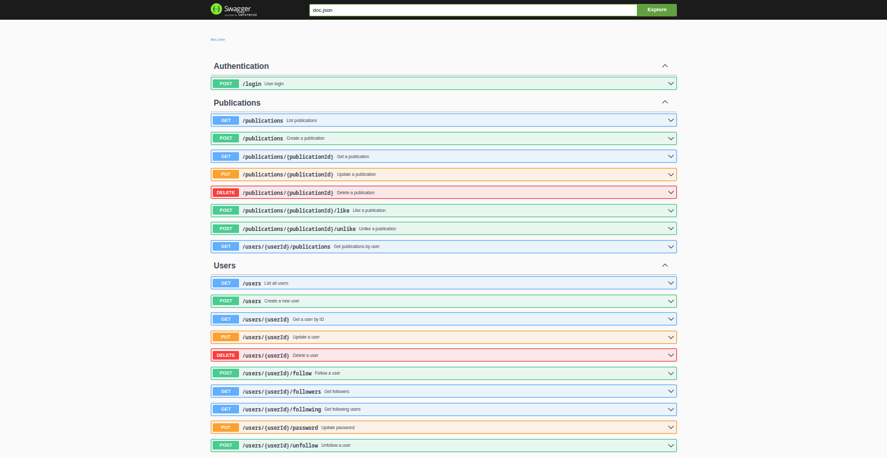

<h1 align="center"> <strong>📕 Dev Book</strong> </h1>

<p align="center">


## 📖 About

Dev Book This project implements a complete **CRUD (Create, Read, Update, Delete)** following a **modern and well-defined package structure**. The main goal is to provide an **organized, sustainable and easy-to-maintain** code base for efficient data management.

## ✨ Features

- 🚀 Implementing a complete posts API with endpoints for searching, creating, editing, and deleting publications and users.
- 🔒 Login and authentication with JWT.
- 🛠️ Implementing MYSQL as the database for the API.
- 📚 Comprehensive API documentation with Swagger.

## 🛠️Technologies:
This project was made using the follow technologies:

[](https://skillicons.dev)


## 🏃Getting Started

1. Clone the repository:
```sh
$ git clone https://github.com/wesleywcr/dev-book.git
$ cd dev-book
   ```
  
2. Set up the environment variables:
   - Copy the `example.env` file to `.env` and configure it as needed.

3. Install the dependencies:   
```sh 
$ go mod download
  ```

4. Start the application using Docker Compose:
```sh 
$ docker compose up --build
$ docker compose start
 ```

5. Run the application:
```sh 
$ go run main.go
```

## 📘 Usage

- Access the API documentation at `http://localhost:5000/swagger/index.html`.
- Use the provided endpoints to manage your resources effectively.


## 🤝 Contributing

We welcome contributions! To get started:

1. Fork the repository.
2. Create a new branch:
   ```bash
   git checkout -b feature/your-feature-name
   ```
3. Commit your changes:
   ```bash
   git commit -m "Add your message here"
   ```
4. Push to your branch:
   ```bash
   git push origin feature/your-feature-name
   ```

5. Open a pull request.
# 

Released in 2025.
Made with ❤️ by [Wesley Rodrigues](https://github.com/wesleywcr)🤙👊